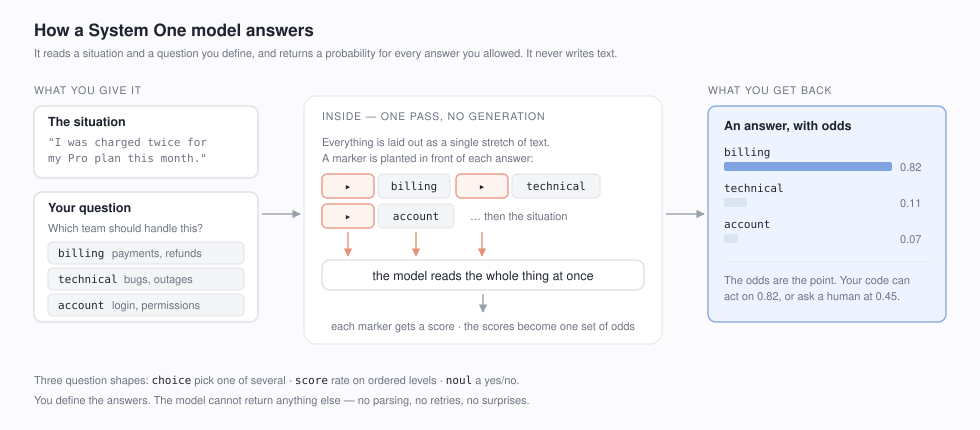
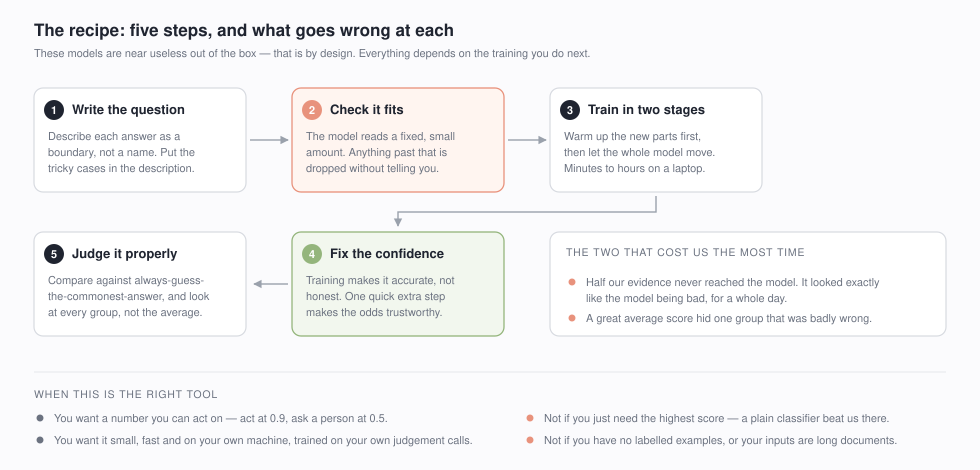

# Fine-tuning System One models

A practical, measured guide to training a small model that makes **decisions
you can act on** — not paragraphs you have to parse.

---

## What is a System One model?

Most models you know write text. You ask a question, you get sentences back,
and your code has to pull the answer out of them — and handle the times it
comes back in an unexpected shape.

A System One model does something different. You tell it what the possible
answers are. It reads the situation and hands back **how likely each answer
is**. It cannot say anything else.



Two models work this way today: **Laya**, which is open and runs on your own
machine, and **Jev**, which is a paid hosted service. This guide uses Laya,
because you can download it and train it yourself.

---

## Why bother?

**You get a number, not a sentence.** "0.82" is something your code can branch
on. Act automatically above 0.9, send it to a person below 0.6, and you have a
system whose behaviour you can actually reason about.

**It is small and it is yours.** It runs on a laptop. Your data never leaves
your machine. There is no per-request bill and no rate limit.

**It answers fast.** No text is generated, so there is nothing to wait for
word by word.

**The catch, stated up front:** out of the box these models are close to
useless. Laya's own documentation says so — untrained, it can do worse than
always guessing the most common answer. That is deliberate. It is a starting
point built to be trained on *your* problem, and the training is the whole job.

That is what this guide is for.

---

## The recipe



Five steps. The second one is the step everyone skips and it is the one that
quietly ruins runs — the model only reads a small, fixed amount of text, and
anything past that is thrown away without any warning. We lost most of a day to
exactly this, convinced the model was bad when really it was never shown the
evidence.

---

## What it actually achieved

The real experiment took **about two hours on a laptop**. We trained on one
collection of documents and then tested on a completely different one, to see
whether what it learned carried over.

Before training, the model was **worse than the plain keyword search** we were
trying to improve on. After training, it was clearly better than it — a large
move, and it held up on a collection it had never seen.

Then we did the comparison most projects leave out. We put it head to head with
an ordinary off-the-shelf model roughly **twenty times smaller**, on identical
data. It beat us, comfortably, while running about seven times faster.

Where our model won was **knowing when it was unsure**. Its confidence was
roughly twice as trustworthy, measured after giving both models the same
fairness adjustment.

That is the honest summary. If you want raw accuracy, the small ordinary model
is the better buy. If you want a number you can safely act on, this is the
trade you are making, and now you know its size before you spend the afternoon.

---

## Try it in a minute

Before committing to anything, there is a tiny example that runs the whole
process start to finish so you can watch it work. You will need Python and
about 2 GB of disk.

```bash
git clone https://github.com/omkarghugarkar007/system-one-model-finetuning
cd system-one-model-finetuning

make install     # set up Python
make weights     # download the model, about 1.7 GB
make quickstart  # train it
```

It teaches the model to rate how serious an incident report is. The interesting
part is that **the rule deliberately disagrees with the tone**: a calmly written
note about a total outage is serious, and a furious complaint about a broken
internal dashboard is not.

An untrained model goes by tone, because that is what it picked up from general
text. After a minute of training it follows your rule instead — more answers
right, and its confidence far more trustworthy. That second part is the one that
matters, and it is the part most people never measure.

This little example is a demonstration, not a result. The real work above took
two hours and a proper dataset.

---

## Using your own data

Write one line per example:

```json
{"state": "I was charged twice for my Pro plan",
 "type": "choice",
 "instructions": "Which team should handle this?",
 "criteria": {"billing": "payments, invoices, refunds",
              "technical": "bugs, outages, integrations"},
 "label": "billing"}
```

Then point the second example at your file. There are three shapes of question:

- **choice** — pick one of several options. *Which team owns this ticket?*
- **score** — rate on a scale where the order matters. *How severe, 0 to 3?*
- **noul** — a plain yes or no. *Is this a refund request?*

A tip worth more than it sounds: describe each answer as a **boundary**, not a
name. `"billing"` tells the model nothing. `"billing: payments, invoices,
refunds, subscription charges"` tells it where the line is. That description is
read by the model, and improving it is the cheapest quality you can buy.

---

## Three worked examples

**Quickstart** — the whole recipe end to end, on a task that ships with it.
Start here.

**Your own data** — point it at a file of your examples and it runs the same
process: checks your data fits, trains, scores itself, and fixes its confidence.

**Is a teacher worth it?** — a common piece of advice is to have a bigger model
label your data for you. We tested it three ways and, on our task, it made no
difference: the bigger model simply agreed with our labels, so it had nothing to
add. Worth running on your own data before you pay for it.

---

## Four things that will bite you

**Your text may never reach the model.** There is a small fixed budget, and when
your answer descriptions are long they all get trimmed to fit — sometimes to
just a few words each. The check for this runs before training and stops you.

**Where you put the information changes everything.** We moved the same content
from one part of the input to another, changed nothing else, and the results
improved dramatically. It is worth trying both ways on your task.

**A good average hides bad groups.** Laya's own published numbers include an
excellent overall confidence score that conceals one category where the model
was badly wrong. Always look at the breakdown, never the single number.

**Training does not make confidence honest.** It makes the model more often
right, but its sense of "how sure am I" drifts. There is a quick final step that
fixes this, and it is not optional if you plan to act on the numbers.

---

## When *not* to use one of these

We would rather tell you this than have you find out later.

- **If you only need the best accuracy**, use an ordinary classifier. We tested
  ours against a well-known small model twenty times smaller, and it beat us
  clearly while running seven times faster. Ours was better at *knowing when it
  was unsure* — but if you do not need that, you do not need this.
- **If your task needs reasoning or step-by-step thinking**, these models are
  too small. Use a bigger one.
- **If you have no labelled examples**, there is nothing to train on, and
  untrained these models are not useful.
- **If your inputs are long documents**, they will not fit. You would have to
  pick out the relevant part first, and that becomes the hard problem.

Use one when you want **a trustworthy number from a small, fast, private model
trained on your own judgement calls**.

---

## Honesty note

This came out of a research project on search ranking. Not everything we tried
worked, and the write-up keeps the failures in — including the one where a much
smaller off-the-shelf model beat ours, and the two bugs that produced convincing
results that turned out to be wrong.

- **THE-RECIPE** *(RECIPE.md)* — the detailed how-to, with the numbers.
- **WHAT-WE-FOUND** *(FINDINGS.md)* — everything measured, successes and failures.
- **THE-ORIGINAL-PLAN** *(docs/research/)* — the research this grew out of, and
  which of its predictions survived.

Apache-2.0. Built on [Laya](https://huggingface.co/convaiinnovations/laya)
by ConvAI Innovations, following the question format from
[TypeSafe](https://docs.typesafe.ai/).
